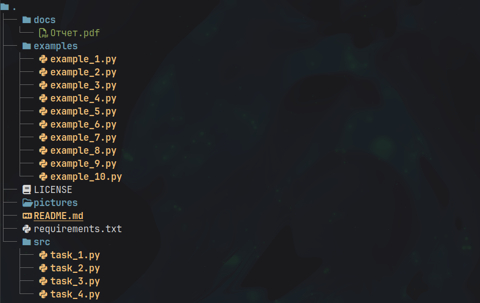

# Лабораторная работа №8 (4.7)
**Предмет** Объектно-ориентированное программирование  
**Тема:** Основы работы с Tkinter.  
**Вариант:** 8  

## Содержание

1. [Описание работы](#описание-работы)  
2. [Ссылка на отчет](#ссылка-на-отчет)  
3. [Структура репозитория](#структура-репозитория)  
4. [Задания](#задания)  

---

## Описание работы

приобретение навыков построения графического интерфейса пользователя GUI с помощью пакета Tkinter языка программирования Python версии 3.x.

---

## Ссылка на отчет

[Отчет о выполнении лабораторной работы](docs/Отчет.pdf)

---

## Структура репозитория

- `src/` — исходный код программы  
- `docs/` — отчет по лабораторной работе  
- `pictures/` — вспомогательные изображения
- `examples/` — примеры из лабораторной работы
- `.pre-commit-config.yaml` — конфигурация pre-commit
- `requirements.txt` — список зависимостей

---

## Задания

### Задание №1  
[Исходный код задания](src/task_1.py)  

Решите задачу: напишите простейший калькулятор, состоящий из двух текстовых полей, куда пользователь вводит числа, и четырех кнопок "+", "-", "*", "/". Результат вычисления должен отображаться в метке. Если арифметическое действие выполнить невозможно (например, если были введены буквы, а не числа), то в метке должно появляться слово "ошибка".

### Задание №2  
[Исходный код задания](src/task_2.py)  

Решите задачу: напишите программу, состоящую из семи кнопок, цвета которых соответствуют цветам радуги. При нажатии на ту или иную кнопку в текстовое поле должен вставляться код цвета, а в метку – название цвета. Коды цветов в шестнадцатеричной кодировке: #ff0000 – красный, #ff7d00 – оранжевый, #ffff00 – желтый, #00ff00 – зеленый, #007dff – голубой, #0000ff – синий, #7d00ff – фиолетовый.

### Задание №3 
[Исходный код задания](src/task_3.py)  

Решите задачу: перепишите программу задания №2 так, чтобы интерфейс выглядел подругому.

### Задание №4
[Исходный код задания](src/task_4.py)

Решите задачу: напишите программу, состоящую из однострочного и многострочного текстовых полей и двух кнопок "Открыть" и "Сохранить". При клике на первую должен открываться на чтение файл, чье имя указано в поле класса Entry , а содержимое файла должно загружаться в поле типа Text . При клике на вторую кнопку текст, введенный пользователем в экземпляр Text , должен сохраняться в файле под именем, которое пользователь указал в однострочном текстовом поле. Файлы будут читаться и записываться в том же каталоге, что и файл скрипта, если указывать имена файлов без адреса. Для выполнения практической работы вам понадобится функция open языка Python и методы файловых объектов чтения и записи. Освежить знания о файлах можно из материала лабораторной работы 9.
